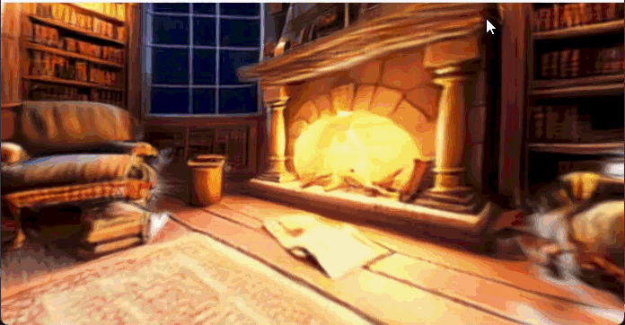

## Offaxis World Demo
### Introduction
Inspired by [Ian Curtis](https://www.linkedin.com/in/ian-curtis-138492102/), Product Designer at [World Labs](https://www.worldlabs.ai/), and his post on exploring different worlds in the browser with off-axis projection.


What if your browser window was a portal into another world?

This demo explores that idea — using off-axis projection to make your screen feel like a physical window into a 3D space. As your face moves, the perspective shifts in real time, creating the illusion that the world exists *behind* the screen.

Built with:
- **[Three.js](https://threejs.org/)** — 3D rendering in the browser
- **[Spark](https://sparkjs.dev/)** — Gaussian splat renderer for Three.js, by WorldLabs
- **[MediaPipe](https://mediapipe.dev/)** — face tracking to drive off-axis projection

May try:
- **[WorldLabs Chisel](https://worldlabs.ai/chisel)** — block out a 3D layout in Blender, then generate a detailed world (.spz) with Chisel.

### Getting Started
Kindly make sure you have Node.js installed:

**[Node.js](https://nodejs.org/)** — v18 or above recommended

1. **Clone the repository**
```bash
   git clone https://github.com/vortextaylors/offaxis-world-web-demo.git
   cd spark-react-r3f
```

2. **Download assets** — this will download the `.spz`, `.glb`, and other 3D asset files
```bash
   npm run assets:download
```

3. **Install dependencies**
```bash
   npm install
```

4. **Start the development server**
```bash
   npm run dev
```

5. **Open your browser** and navigate to [http://localhost:5173](http://localhost:5173)

### Result


Instead of recreating the `.spz` from scratch, this prototype reuses the 3D assets already downloaded from the Spark sample library.

Trying to make the demo effect works like a physical window, the 3D scene is fixed in space, and your head position determines the angle you see it from.

| Move | See |
|---|---|
| Left | Right side of the scene |
| Right | Left side of the scene |
| Up | Bottom of the scene |
| Down | Top of the scene |
| Closer | More parallax, wider view |
| Farther back | Narrower view, less depth |

> **Note:** `.spz` (Gaussian Splat ZIP) is a compressed Gaussian splat format developed by Niantic Lab. Compared to other formats like `.ply`, `.gltf`, and `.glb`, `.spz` files are significantly smaller in size, making them ideal for fast loading, web streaming, and real-time rendering in the browser. Other splat formats such as `.splat` and `.ksplat` are also supported by Spark and work well, though `.spz` offers the best compression overall.

### References
- [MindDock — Off-Axis MediaPipe GitHub Demo](https://github.com/MindDock/off-axis-demo)
- [Spark React Next.js GitHub Example](https://github.com/sparkjsdev/spark-react-nextjs)
- [WorldLabs Chisel: 3D Blocking — YouTube](https://www.youtube.com/watch?v=7r_5FHpssa8)
- [Niantic Labs — SPZ Format GitHub](https://github.com/nianticlabs/spz)